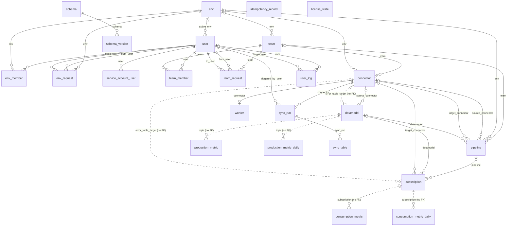
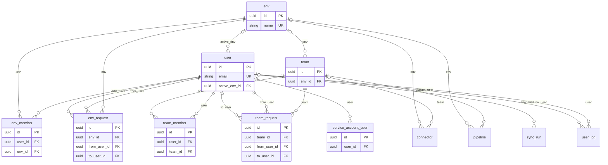
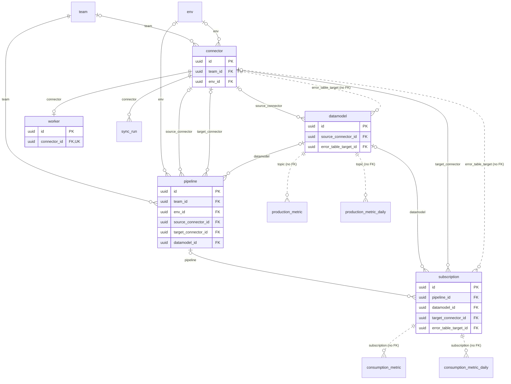
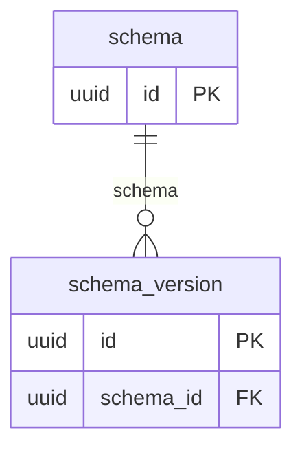
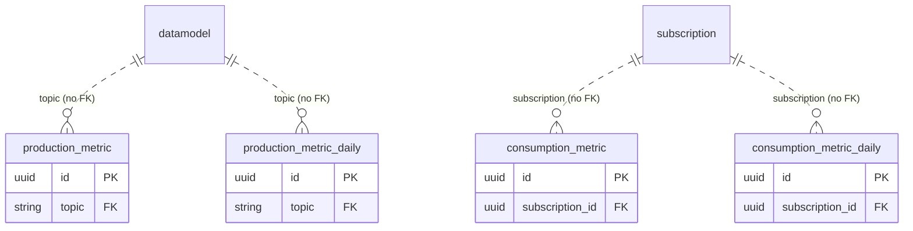
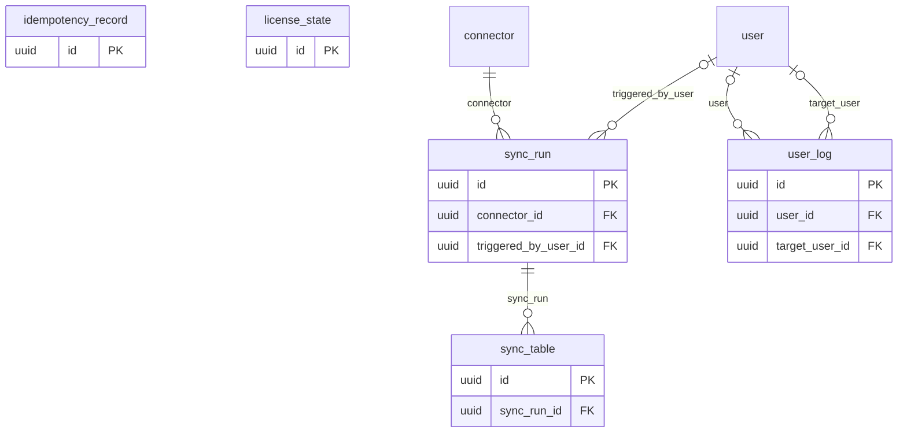

{/* Generated from the data-plane's SQLAlchemy models by `inv dp.dm`. Refresh it by copying data-plane/docs/data-model.mdx over this file — never by editing it here, which would make it disagree with the shipped schema at the next migration. */}

The data-plane keeps its own PostgreSQL database. It holds **configuration and operational records only** — which systems to read, how to shape what they produce and where to deliver it, plus who may change any of that. **Your rows never land here**: replicated data travels source → broker → target and is never written to this database.

24 tables in 5 subject areas, 37 references between them.

## How to read this

- **An arrow points from the row holding the reference to the row it names.** `subscription → connector` means a subscription row stores the id of a connector row.
- **A dashed arrow is a reference with no foreign key behind it.** Always deliberate, and always for the same reason: the referenced row may be deleted while the referring row has to survive it. Every one is listed, with its reason, at the end of this document.
- **`PK` is the primary key, `FK` a reference, `UK` a value unique across the table.** Every table is keyed by a UUID v4 generated by the application, and carries `created_at` / `updated_at`.

## Map

## Access and organisation

Who may act, and on what. Environments hold teams, teams hold everything else, and membership in either is what every permission check reads.

### `env`

The top of the hierarchy: one environment, its teams, and the broker they share.

Environments are synchronised from the control-plane by UUID, which is why two data-planes must never share a database — the names would collide.

| Column | Type | Null | Description |
| --- | --- | --- | --- |
| `id` | `UUID` | required | Primary key: a UUID v4 generated by the application, never by the database. |
| `name` | `VARCHAR(100)` | optional | Env name. |
| `retention_configuration` | `JSON` | required | Json retention env configuration (broker config). |
| `config_hash` | `VARCHAR(64)` | optional | SHA-256 hash of deployment configuration (64 hex characters) |
| `created_at` | `DATETIME` | optional | When the record was created. |
| `updated_at` | `DATETIME` | optional | When the record was last updated. |

### `env_member`

A user's membership of an environment, and the role it grants there.

One row per (user, env): a duplicate makes every later permission check raise, which is why the write path takes an advisory lock rather than relying on a read-then-insert.

| Column | Type | Null | Description |
| --- | --- | --- | --- |
| `id` | `UUID` | required | Primary key: a UUID v4 generated by the application, never by the database. |
| `timestamp` | `DATETIME` | required | When the membership was granted. |
| `role` | `VARCHAR(16)` | required | Environment role: admin, member or reader (#3531). |
| `user_id` | `UUID` | required | The member. |
| `env_id` | `UUID` | required | The environment they are a member of. |
| `created_at` | `DATETIME` | optional | When the record was created. |
| `updated_at` | `DATETIME` | optional | When the record was last updated. |

References: `user_id` → `user.id`, `ON DELETE CASCADE`; `env_id` → `env.id`, `ON DELETE CASCADE`.

Indexed on: `(user_id, env_id)`.

### `env_request`

A pending join or invitation to an environment, and the role acceptance would grant.

The same row shape covers both directions: a user asking to join and an admin inviting differ only in who ``from_user_id`` is.

| Column | Type | Null | Description |
| --- | --- | --- | --- |
| `id` | `UUID` | required | Primary key: a UUID v4 generated by the application, never by the database. |
| `role` | `VARCHAR(16)` | required | Env role granted on acceptance: admin, member or reader (#3531). |
| `env_id` | `UUID` | required | Environment ID. |
| `from_user_id` | `UUID` | required | Request author (user or admin). |
| `to_user_id` | `UUID` | required | Target user of the request. |
| `status` | `VARCHAR(32)` | required | Request status. |
| `created_at` | `DATETIME` | optional | When the record was created. |
| `updated_at` | `DATETIME` | optional | When the record was last updated. |

References: `env_id` → `env.id`, `ON DELETE CASCADE`; `from_user_id` → `user.id`; `to_user_id` → `user.id`.

Indexed on: `(env_id)`; `(from_user_id)`; `(to_user_id)`.

### `service_account_user`

A named machine identity, backed by a real user row.

Its token carries both ids, and every permission check reads the user — the service account only gives the token a name and a lifetime of its own.

| Column | Type | Null | Description |
| --- | --- | --- | --- |
| `id` | `UUID` | required | Primary key: a UUID v4 generated by the application, never by the database. |
| `name` | `VARCHAR(300)` | required | Service account user name. |
| `user_id` | `UUID` | required | The user identity this service account acts as, and whose permissions it gets. |
| `created_at` | `DATETIME` | optional | When the record was created. |
| `updated_at` | `DATETIME` | optional | When the record was last updated. |

References: `user_id` → `user.id`, `ON DELETE CASCADE`.

### `team`

The unit of ownership: every pipeline and connector belongs to exactly one.

Team membership is what a write is authorized against, so a team is also the smallest thing two people can be given different access to.

| Column | Type | Null | Description |
| --- | --- | --- | --- |
| `id` | `UUID` | required | Primary key: a UUID v4 generated by the application, never by the database. |
| `name` | `VARCHAR(100)` | optional | Team name. |
| `description` | `TEXT` | optional | Team description. |
| `env_id` | `UUID` | optional | Environment the team lives in; connectors and pipelines mirror it (#2527). |
| `created_at` | `DATETIME` | optional | When the record was created. |
| `updated_at` | `DATETIME` | optional | When the record was last updated. |

References: `env_id` → `env.id`, `ON DELETE SET NULL`.

Unique together: (`env_id`, `name`).

### `team_member`

A user's membership of a team — the row every write permission check reads.

One row per (user, team), for the same reason ``EnvMember`` is: a duplicate makes every later check raise. An API key's memberships are derived from its grants and written here too, so authorization has one shape whoever the caller is.

| Column | Type | Null | Description |
| --- | --- | --- | --- |
| `id` | `UUID` | required | Primary key: a UUID v4 generated by the application, never by the database. |
| `timestamp` | `DATETIME` | required | When the membership was granted. |
| `admin` | `BOOLEAN` | optional | Whether the member administrates the team, rather than only working in it. |
| `user_id` | `UUID` | required | The member. |
| `team_id` | `UUID` | required | The team they are a member of. |
| `created_at` | `DATETIME` | optional | When the record was created. |
| `updated_at` | `DATETIME` | optional | When the record was last updated. |

References: `user_id` → `user.id`, `ON DELETE CASCADE`; `team_id` → `team.id`, `ON DELETE CASCADE`.

Indexed on: `(user_id, team_id)`.

### `team_request`

A pending join or invitation to a team, and whether acceptance would grant admin.

The same row shape covers both directions: a user asking to join and an admin inviting differ only in who ``from_user_id`` is.

| Column | Type | Null | Description |
| --- | --- | --- | --- |
| `id` | `UUID` | required | Primary key: a UUID v4 generated by the application, never by the database. |
| `admin` | `BOOLEAN` | required | Is admin request? |
| `team_id` | `UUID` | required | Team ID. |
| `from_user_id` | `UUID` | required | Request author (user or admin). |
| `to_user_id` | `UUID` | required | Target user of the request. |
| `status` | `VARCHAR(32)` | required | Request status. |
| `created_at` | `DATETIME` | optional | When the record was created. |
| `updated_at` | `DATETIME` | optional | When the record was last updated. |

References: `team_id` → `team.id`; `from_user_id` → `user.id`; `to_user_id` → `user.id`.

Indexed on: `(from_user_id)`; `(team_id)`; `(to_user_id)`.

### `user`

A person or machine identity that can act on this data-plane.

Also backs every service account: a service-account token carries both ids and every permission check reads the user, so there is no second identity table.

| Column | Type | Null | Description |
| --- | --- | --- | --- |
| `id` | `UUID` | required | Primary key: a UUID v4 generated by the application, never by the database. |
| `email` | `VARCHAR(320)` | required | Login and, for historical rows, the actor of record. |
| `hashed_password` | `VARCHAR(1024)` | optional | Argon2 hash of the local password. NULL is the marker for an identity that has none — control-plane and service-account users authenticate elsewhere. |
| `is_active` | `BOOLEAN` | required | Whether the identity may authenticate at all; deactivation is how a user is revoked without erasing the history they authored. |
| `is_superuser` | `BOOLEAN` | required | Bypasses the environment and team checks. |
| `is_verified` | `BOOLEAN` | required | Whether the email address was confirmed. |
| `version` | `INTEGER` | required | Bumped on every change, so the control-plane membership sync can tell which side is stale without comparing every field. |
| `active_env_id` | `UUID` | optional | Environment the UI last had selected. A preference, never an authorization. |
| `created_at` | `DATETIME` | optional | When the record was created. |
| `updated_at` | `DATETIME` | required | When the record was last updated. Unlike the inherited column this one is timezone-aware and indexed: the membership sync pages on it. |

References: `active_env_id` → `env.id`, `ON DELETE SET NULL`.

Indexed on: `unique (email)`; `(updated_at)`; `(version)`.

## Pipelines

The configured data flow itself: a source connector reads a system, a datamodel shapes what it produced, and a subscription delivers that into a target connector.

### `connector`

An integration point with one external system, read from or written to.

Whether it is a source or a target is derived from its type, never chosen; its configuration is encrypted at rest, so anything selecting ``json_configuration`` — even through a join — owes a decrypt (#3698). Exactly one worker runs it.

| Column | Type | Null | Description |
| --- | --- | --- | --- |
| `id` | `UUID` | required | Connector ID. |
| `name` | `VARCHAR(100)` | optional | Connector name. |
| `connector_type` | `VARCHAR(50)` | required | Connector specific type (Snowflake target, Job SMT, PostgreSQL source...). |
| `json_configuration` | `JSON` | required | Json connector definition. |
| `way` | `VARCHAR(6)` | required | Is the connector a source or a target? |
| `team_id` | `UUID` | optional | Team ID that owns this connector. |
| `env_id` | `UUID` | optional | Env ID this connector belongs to (mirrors team.env_id). _Mirrors team.env_id so the (env, name) uniqueness is one table's business (#2527)._ |
| `created_at` | `DATETIME` | optional | When the record was created. |
| `updated_at` | `DATETIME` | optional | When the record was last updated. |

References: `team_id` → `team.id`; `env_id` → `env.id`.

Unique together: (`env_id`, `name`).

Indexed on: `(lower(name))`.

### `datamodel`

The shape of what a source produced, and the topic it is republished on.

Sits between the raw CDC topic and the subscriptions: one datamodel feeds as many subscriptions as there are places the data has to land.

| Column | Type | Null | Description |
| --- | --- | --- | --- |
| `id` | `UUID` | required | DataModel ID. |
| `name` | `VARCHAR(100)` | required | DataModel name. |
| `config` | `JSON` | required | JSON configuration defining the data structure/schema. |
| `source_connector_id` | `UUID` | optional | Associated source connector ID. |
| `source_topic` | `VARCHAR(255)` | optional | Associated source topic to read from. |
| `target_topic` | `VARCHAR(255)` | optional | Associated target topic to write to. |
| `consumer_id` | `VARCHAR(255)` | optional | Consumer group ID for Kafka consumption. |
| `error_table_enabled` | `BOOLEAN` | optional | Associated error table enabled. |
| `error_table_name` | `VARCHAR(255)` | optional | Associated error table name. |
| `error_table_target_id` | `UUID` | optional | Associated error table target connector ID (None when no error table is configured). |
| `enabled` | `BOOLEAN` | optional | Whether this datamodel is enabled for processing. |
| `created_at` | `DATETIME` | optional | When the record was created. |
| `updated_at` | `DATETIME` | optional | When the record was last updated. |

References: `source_connector_id` → `connector.id`, `ON DELETE SET NULL`; `error_table_target_id` → `connector.id` (no foreign key: Optional pointer at the connector receiving rejected rows; unset on most datamodels.).

Indexed on: `(lower(name))`.

### `pipeline`

One configured flow from a source connector to a target connector.

A pipeline has no state column of its own: what the UI shows is its worker's state, and "draft" is the computed absence of one — ``is_completed`` false with the worker paused.

| Column | Type | Null | Description |
| --- | --- | --- | --- |
| `id` | `UUID` | required | Pipeline ID. |
| `name` | `VARCHAR(100)` | optional | Pipeline name. |
| `json_configuration` | `JSON` | required | Json pipline definition. |
| `version` | `INTEGER` | required | Pipeline version. Incremented when the pipeline is modified. |
| `is_completed` | `BOOLEAN` | optional | Whether the pipeline configuration is complete (has subscription config). |
| `error_table_config` | `JSON` | optional | Error table configuration for the pipeline. |
| `team_id` | `UUID` | required | Attached team ID. |
| `env_id` | `UUID` | optional | Env ID this pipeline belongs to (mirrors team.env_id). _Mirrors team.env_id so the (env, name) uniqueness is one table's business (#2527)._ |
| `source_connector_id` | `UUID` | optional | Source connector ID. |
| `target_connector_id` | `UUID` | optional | Target connector ID. |
| `datamodel_id` | `UUID` | optional | Data model ID. |
| `created_at` | `DATETIME` | optional | When the record was created. |
| `updated_at` | `DATETIME` | optional | When the record was last updated. |

References: `team_id` → `team.id`; `env_id` → `env.id`; `source_connector_id` → `connector.id`; `target_connector_id` → `connector.id`; `datamodel_id` → `datamodel.id`.

Unique together: (`env_id`, `name`).

Indexed on: `(lower(name))`.

### `subscription`

One delivery: how a datamodel's rows are transformed and written into one target table.

Identified by (datamodel, target connector, target table), because fanning one topic out into several tables of the same target is a shape the wizard produces on purpose.

| Column | Type | Null | Description |
| --- | --- | --- | --- |
| `id` | `UUID` | required | Subscription ID. |
| `name` | `VARCHAR(255)` | required | Name of the subscription. |
| `config` | `JSON` | required | JSON configuration for the subscription. |
| `transform_config` | `JSON` | required | JSON configuration for data transformations. |
| `pipeline_id` | `UUID` | optional | Associated pipeline ID. |
| `datamodel_id` | `UUID` | optional | Associated datamodel ID. |
| `target_connector_id` | `UUID` | optional | Associated target connector ID. |
| `error_table_enabled` | `BOOLEAN` | required | Associated error table enabled. |
| `error_table_name` | `VARCHAR(255)` | optional | Associated error table name. |
| `error_table_target_id` | `UUID` | optional | Associated error table target connector ID (UUID). |
| `target_table_name` | `VARCHAR(255)` | optional | Target table name for output data. |
| `consumer_id` | `VARCHAR(255)` | optional | Consumer group ID for Kafka consumer. Defaults to subscription ID if not provided. |
| `backfill` | `BOOLEAN` | optional | Reload trigger: when switched on, the subscription's consumer group is reset to earliest (#2965). Default aligned with the domain entity. |
| `enabled` | `BOOLEAN` | optional | Whether this subscription is enabled for processing. |
| `created_at` | `DATETIME` | optional | When the record was created. |
| `updated_at` | `DATETIME` | optional | When the record was last updated. |

References: `pipeline_id` → `pipeline.id`, `ON DELETE SET NULL`; `datamodel_id` → `datamodel.id`, `ON DELETE SET NULL`; `target_connector_id` → `connector.id`, `ON DELETE SET NULL`; `error_table_target_id` → `connector.id` (no foreign key: Optional pointer at the connector receiving rejected rows; unset on most subscriptions.).

Unique together: (`datamodel_id`, `target_connector_id`, `target_table_name`).

### `worker`

The execution state of one connector's pod — both what we want and what we observed.

``state`` carries the two at once: ``STOPPING`` is an intent, ``LIVE`` an observation, so every runtime write goes through ``Worker.accepts_reported_state()`` under a row lock. A heartbeat older than 90 s means the pod stopped reporting, not that it stopped.

| Column | Type | Null | Description |
| --- | --- | --- | --- |
| `id` | `UUID` | required | Worker ID. |
| `state` | `VARCHAR(8)` | required | Worker current state. |
| `connector_id` | `UUID` | required | Connector ID that this worker belongs to. |
| `last_heartbeat_at` | `DATETIME` | optional | Timestamp of last heartbeat from worker. |
| `reason` | `VARCHAR` | optional | Optional human-readable detail for the current state (e.g. error message). |
| `stop_requested_at` | `DATETIME` | optional | When an operator requested the worker to stop. Set iff state is STOPPING, cleared on every other transition; drives the stopping timeout (#3509). |
| `launch_generation` | `UUID` | required | Opaque token identifying the currently launched pod generation (#3523). |
| `created_at` | `DATETIME` | optional | When the record was created. |
| `updated_at` | `DATETIME` | optional | When the record was last updated. |

References: `connector_id` → `connector.id`, `ON DELETE CASCADE`.

## Schema registry

The Avro schemas seen on the topics, de-duplicated by content hash and versioned per subject.

### `schema`

One schema document, stored once per distinct content.

De-duplicated by ``hash``: the same Avro schema registered under twenty subjects is one row here and twenty ``SchemaVersion`` rows pointing at it.

| Column | Type | Null | Description |
| --- | --- | --- | --- |
| `id` | `UUID` | required | Primary key: a UUID v4 generated by the application, never by the database. |
| `type` | `VARCHAR(4)` | required | Which schema language: json or avro. |
| `hash` | `VARCHAR` | required | Content hash — the identity that makes a re-registration a no-op. |
| `schema` | `TEXT` | required | The schema document itself, verbatim. |
| `created_at` | `DATETIME` | optional | When the record was created. |
| `updated_at` | `DATETIME` | optional | When the record was last updated. |

### `schema_version`

One version of one subject: what a topic's key or value looked like at a point in time.

The history is what lets a consumer read a message written before the current schema.

| Column | Type | Null | Description |
| --- | --- | --- | --- |
| `id` | `UUID` | required | Primary key: a UUID v4 generated by the application, never by the database. |
| `timestamp` | `DATETIME` | required | When this version was registered. |
| `version` | `INTEGER` | required | Version number within the subject, counting from 1. |
| `subject` | `VARCHAR` | required | Registry subject, conventionally '\<topic>-key' or '\<topic>-value'. |
| `schema_id` | `UUID` | required | The de-duplicated schema document this version resolves to. |
| `created_at` | `DATETIME` | optional | When the record was created. |
| `updated_at` | `DATETIME` | optional | When the record was last updated. |

References: `schema_id` → `schema.id`.

## Throughput metrics

Append-only evidence of what actually moved: raw snapshots pushed by workers, and the closed-day rollups the charts read.

### `consumption_metric`

Append-only table for per-subscription consumption metrics.

Each row represents one consumption snapshot for a given subscription/topic over the interval [from_ts, to_ts] (epoch ms). Distinct from ``metric`` which stores source-side production counts: two subscriptions on the same source topic produce two independent rows here, capturing their actual delivery progress (consumed/delivered/errored/lag).

| Column | Type | Null | Description |
| --- | --- | --- | --- |
| `id` | `UUID` | required | Primary key: a UUID v4 generated by the application, never by the database. |
| `subscription_id` | `UUID` | required | Subscription this consumption snapshot belongs to. No FK by design: deleting a subscription must NOT erase its historical consumption rows — the id stays readable so past deliveries can still be traced (billing, post-mortems). |
| `topic` | `VARCHAR` | required | Kafka source topic being consumed. |
| `from_ts` | `BIGINT` | required | Start of the measurement interval (epoch ms). |
| `to_ts` | `BIGINT` | required | End of the measurement interval (epoch ms). |
| `consumed_count` | `BIGINT` | required | Number of records read from the source topic during the interval. |
| `delivered_count` | `BIGINT` | required | Number of records successfully delivered to the target during the interval. |
| `error_count` | `BIGINT` | required | Number of records that failed delivery during the interval. |
| `consumer_lag` | `BIGINT` | optional | Consumer-group lag (records behind) at to_ts. Null when not measurable. |
| `created_at` | `DATETIME` | optional | When the record was created. |
| `updated_at` | `DATETIME` | optional | When the record was last updated. |

References: `subscription_id` → `subscription.id` (no foreign key: Deleting a subscription must not erase what it already delivered, and no FK action means 'keep the row and the id'.).

Indexed on: `(subscription_id, created_at)`.

### `consumption_metric_daily`

Pre-aggregated daily rollup of ``consumption_metric``, one row per (subscription_id, day).

Populated by the metric rollup background task for closed UTC days only, mirroring ``ProductionMetricDaily``. Nothing reads it yet: the dashboard summary is production-only, and the per-subscription detail path (raw rows + live lag) must keep reading raw — this table is the substrate for the detail-page aggregation follow-up flagged in #3200.

``consumer_lag`` is deliberately absent: it is a point-in-time gauge, not a summable counter, and its live value comes from the broker at read time.

No FK on ``subscription_id`` — evidence must survive subscription deletion (see docs/claude/architecture-decisions.md).

| Column | Type | Null | Description |
| --- | --- | --- | --- |
| `id` | `UUID` | required | Primary key: a UUID v4 generated by the application, never by the database. |
| `subscription_id` | `UUID` | required | Subscription the deliveries belong to (no FK; mirrors consumption_metric). |
| `topic` | `VARCHAR` | required | Source topic consumed (last seen within the day; informational). |
| `day` | `DATE` | required | Closed UTC calendar day this row aggregates. |
| `consumed_count` | `BIGINT` | required | SUM(consumed_count) over the day. |
| `delivered_count` | `BIGINT` | required | SUM(delivered_count) over the day. |
| `error_count` | `BIGINT` | required | SUM(error_count) over the day. |
| `span_ms` | `BIGINT` | required | SUM of per-row measurement spans (to_ts - from_ts clamped at 0), rate input. |
| `min_from` | `BIGINT` | required | MIN(from_ts) over the day (epoch ms), rate input. |
| `max_to` | `BIGINT` | required | MAX(to_ts) over the day (epoch ms), rate input. |
| `row_count` | `BIGINT` | required | COUNT(*) of raw rows aggregated, rate fallback input. |
| `created_at` | `DATETIME` | optional | When the record was created. |
| `updated_at` | `DATETIME` | optional | When the record was last updated. |

References: `subscription_id` → `subscription.id` (no foreign key: Same rule as the raw rows it aggregates: a rollup outlives the subscription.).

Indexed on: `unique (subscription_id, day)`.

### `production_metric`

Append-only table for CDC event production metrics pushed by source workers.

Each row represents one metric snapshot for a given topic, covering the time interval [from_ts, to_ts] expressed as epoch timestamps (ms). ``created_at`` (inherited from Base) acts as the ingestion timestamp.

Paired with ``ConsumptionMetric`` (delivery counts on the target side).

| Column | Type | Null | Description |
| --- | --- | --- | --- |
| `id` | `UUID` | required | Primary key: a UUID v4 generated by the application, never by the database. |
| `from_ts` | `BIGINT` | required | Start of the measurement interval (epoch ms). |
| `to_ts` | `BIGINT` | required | End of the measurement interval (epoch ms). |
| `topic` | `VARCHAR` | required | Kafka topic name. |
| `events` | `JSON` | required | CDC event counts: \{total, r, c, u, d\}. |
| `created_at` | `DATETIME` | optional | When the record was created. |
| `updated_at` | `DATETIME` | optional | When the record was last updated. |

References: `topic` → `datamodel.source_topic` (no foreign key: Production is counted per Kafka topic, and a topic outlives the datamodel that named it; the read path resolves the topic set, then filters on it.).

Indexed on: `(topic, created_at)`.

### `production_metric_daily`

Pre-aggregated daily rollup of ``production_metric``, one row per (topic, day).

Populated by the metric rollup background task for closed UTC days only; the monitoring read path unions this table with raw ``production_metric`` rows for the still-open day. Recomputed idempotently (delete + insert per day), so a crashed or duplicated rollup cycle is harmless.

Like the raw metric tables, this is derived evidence keyed by a plain ``topic`` string — no FK, so history survives topic renames and datamodel deletions (see docs/claude/architecture-decisions.md).

``span_ms`` / ``min_from`` / ``max_to`` / ``row_count`` preserve the message-rate inputs the summary math needs (``_effective_metrics_duration_ms``); without them msg/s would silently change versus raw aggregation.

| Column | Type | Null | Description |
| --- | --- | --- | --- |
| `id` | `UUID` | required | Primary key: a UUID v4 generated by the application, never by the database. |
| `topic` | `VARCHAR` | required | Kafka topic name (no FK; mirrors production_metric.topic). |
| `day` | `DATE` | required | Closed UTC calendar day this row aggregates (matches date_trunc('day', created_at)). |
| `creates` | `BIGINT` | required | SUM(events->c) over the day. |
| `updates` | `BIGINT` | required | SUM(events->u) over the day. |
| `deletes` | `BIGINT` | required | SUM(events->d) over the day. |
| `reads` | `BIGINT` | required | SUM(events->r) over the day. |
| `total_events` | `BIGINT` | required | SUM(events->total) over the day. |
| `bytes` | `BIGINT` | required | SUM(events->bytes) over the day. No worker emits it today (always 0); kept for parity with the raw reader. |
| `span_ms` | `BIGINT` | required | SUM of per-row measurement spans (to_ts - from_ts clamped at 0), rate input. |
| `min_from` | `BIGINT` | required | MIN(from_ts) over the day (epoch ms), rate input. |
| `max_to` | `BIGINT` | required | MAX(to_ts) over the day (epoch ms), rate input. |
| `row_count` | `BIGINT` | required | COUNT(*) of raw rows aggregated, rate fallback input. |
| `created_at` | `DATETIME` | optional | When the record was created. |
| `updated_at` | `DATETIME` | optional | When the record was last updated. |

References: `topic` → `datamodel.source_topic` (no foreign key: Same rule as the raw rows it aggregates.).

Indexed on: `unique (topic, day)`.

## Operations

Everything that records an operator action or a run rather than a configuration: snapshot syncs, the audit log, replay protection and the license verdict.

### `idempotency_record`

Cached response for an (endpoint, idempotency_key) pair.

| Column | Type | Null | Description |
| --- | --- | --- | --- |
| `id` | `UUID` | required | Primary key: a UUID v4 generated by the application, never by the database. |
| `endpoint` | `VARCHAR(200)` | required | Route name (e.g. 'envs:create') the key is scoped to. |
| `key` | `VARCHAR(200)` | required | Client-supplied Idempotency-Key header value. |
| `request_hash` | `VARCHAR(64)` | required | SHA-256 of the serialised request payload. Mismatch on replay returns 422. |
| `response_status` | `INTEGER` | required | HTTP status code that the original request produced. |
| `response_body` | `JSON` | required | JSON-serialised response body returned on the original request. |
| `expires_at` | `DATETIME` | required | When the record may be evicted (typically created_at + 24h). |
| `created_at` | `DATETIME` | optional | When the record was created. |
| `updated_at` | `DATETIME` | optional | When the record was last updated. |

Unique together: (`endpoint`, `key`).

Indexed on: `(expires_at)`.

### `license_state`

Single cached row holding the latest license verdict from the control-plane.

| Column | Type | Null | Description |
| --- | --- | --- | --- |
| `id` | `UUID` | required | Primary key: a UUID v4 generated by the application, never by the database. |
| `license_active` | `BOOLEAN` | required | Last verdict from the control-plane. Defaults to inactive (default-deny). |
| `license_expires_at` | `DATETIME` | optional | Absolute license expiry (naive UTC), for display and grace reasoning. |
| `last_seen_at` | `DATETIME` | required | When the data-plane last received a verdict. Drives the grace window (#3083). |
| `created_at` | `DATETIME` | optional | When the record was created. |
| `updated_at` | `DATETIME` | optional | When the record was last updated. |

### `sync_run`

A connector's current sync (blocking snapshot of 1..N tables, driven one at a time).

| Column | Type | Null | Description |
| --- | --- | --- | --- |
| `id` | `UUID` | required | Primary key: a UUID v4 generated by the application, never by the database. |
| `connector_id` | `UUID` | required | Source connector this sync belongs to. |
| `status` | `VARCHAR(9)` | required | Overall sync status (syncing/done/cancelled). |
| `triggered_by_user_id` | `UUID` | optional | Id of the user who started this sync, as recorded at trigger time. Convenience link only: SET NULL on user delete, and the control-plane user sync deletes/re-creates rows whenever a user churns id — read the author from triggered_by_email instead (#2978). |
| `triggered_by_email` | `VARCHAR(320)` | optional | Author of record: email of the user who started this sync, denormalised at trigger time so authorship survives any change to the user row (same pattern as user_log.user_email). NULL means no author was recorded: a run triggered automatically, or one written before this column existed whose user_id was already nulled at backfill time. _The actor of record. User ids churn on delete and re-invite, so history reads the email, never the id._ |
| `stalled_since` | `DATETIME` | optional | When this run was first observed to have stopped making progress (#3597); NULL while healthy. Stamped with coalesce(existing, now) so no write can postpone it, and it is the clock the abandon ceiling counts on — which is why it is persisted rather than kept in the orchestrator's memory like the gate state: it must survive leadership moving between pods. |
| `stalled_reason` | `VARCHAR(21)` | optional | Why the run is/was stalled (#3597). Kept after a run is abandoned for a stall so the History row can explain why it ended; NULL on a run that never stalled. |
| `created_at` | `DATETIME` | optional | When the record was created. |
| `updated_at` | `DATETIME` | optional | When the record was last updated. |

References: `connector_id` → `connector.id`, `ON DELETE CASCADE`; `triggered_by_user_id` → `user.id`, `ON DELETE SET NULL`.

Indexed on: `unique ((CASE WHEN status = 'SYNCING' THEN connector_id END))`; `(connector_id)`.

### `sync_table`

One table's place in a sync queue plus its blocking-snapshot progress.

| Column | Type | Null | Description |
| --- | --- | --- | --- |
| `id` | `UUID` | required | Primary key: a UUID v4 generated by the application, never by the database. |
| `sync_run_id` | `UUID` | required | Parent sync run. |
| `table_name` | `VARCHAR` | required | Fully-qualified source table name as the worker expects it (e.g. SCHEMA.TABLE). |
| `position` | `INTEGER` | required | Order of the table within the queue (0-based). |
| `status` | `VARCHAR(11)` | required | Per-table status (queued/in_progress/completed/partial/failed). |
| `approximate_row_count` | `BIGINT` | optional | Catalog-stat row estimate from #2910; None when the source exposes no estimate. |
| `group_id` | `UUID` | optional | Shared id of the batched small-table step this table belongs to (#2979); NULL when the table is snapshotted on its own (large table or unknown estimate). |
| `rows_ingested` | `BIGINT` | required | Rows snapshotted so far, as reported by the worker. |
| `started_at` | `DATETIME` | optional | When this table's blocking snapshot started. |
| `finished_at` | `DATETIME` | optional | When this table reached a terminal state (completed/partial/failed). |
| `error_reason` | `VARCHAR` | optional | Short failure detail reported by the worker when status is 'failed' (e.g. source SQL error like SQL0666); NULL for every non-failed table. Surfaced in the Errors section. |
| `created_at` | `DATETIME` | optional | When the record was created. |
| `updated_at` | `DATETIME` | optional | When the record was last updated. |

References: `sync_run_id` → `sync_run.id`, `ON DELETE CASCADE`.

Indexed on: `(sync_run_id, group_id)`; `(sync_run_id, position)`.

### `user_log`

Audit trail of the actions users took on this data-plane.

Append-only, and it outlives its actors: both user references are ``SET NULL`` and the email is denormalised, so deleting a user redacts the link without erasing the action.

| Column | Type | Null | Description |
| --- | --- | --- | --- |
| `id` | `UUID` | required | Primary key: a UUID v4 generated by the application, never by the database. |
| `timestamp` | `DATETIME` | required | When the action was taken. |
| `user_type` | `VARCHAR(9)` | required | Which kind of identity acted (a user, a service account, the system). |
| `action` | `VARCHAR(20)` | required | What was done — the verb, e.g. login, create, delete. |
| `user_id` | `UUID` | optional | Who acted, while that user still exists. NULL does not mean 'system'. |
| `user_email` | `VARCHAR(320)` | optional | Author of record: the actor's email as it stood at the time. _The actor of record. User ids churn on delete and re-invite, so history reads the email, never the id._ |
| `target_user_id` | `UUID` | optional | Who the action was about, when it was about someone other than the actor. |
| `created_at` | `DATETIME` | optional | When the record was created. |
| `updated_at` | `DATETIME` | optional | When the record was last updated. |

References: `user_id` → `user.id`, `ON DELETE SET NULL`; `target_user_id` → `user.id`, `ON DELETE SET NULL`.

## References that are not foreign keys

Each of these points at another table without the schema saying so, and each does it for the same reason: the row it names may be deleted while this row has to outlive it.

| Column | Points at | Why |
| --- | --- | --- |
| `datamodel.error_table_target_id` | `connector.id` | Optional pointer at the connector receiving rejected rows; unset on most datamodels. |
| `subscription.error_table_target_id` | `connector.id` | Optional pointer at the connector receiving rejected rows; unset on most subscriptions. |
| `consumption_metric.subscription_id` | `subscription.id` | Deleting a subscription must not erase what it already delivered, and no FK action means 'keep the row and the id'. |
| `consumption_metric_daily.subscription_id` | `subscription.id` | Same rule as the raw rows it aggregates: a rollup outlives the subscription. |
| `production_metric.topic` | `datamodel.source_topic` | Production is counted per Kafka topic, and a topic outlives the datamodel that named it; the read path resolves the topic set, then filters on it. |
| `production_metric_daily.topic` | `datamodel.source_topic` | Same rule as the raw rows it aggregates. |

## What is sensitive, and what is not

| Column | What it holds |
| --- | --- |
| `connector.json_configuration` | Everything needed to reach one of your systems, including credentials. Encrypted at rest with the deployment's own key, and redacted again on every read of the API. |
| `user.hashed_password` | A password hash, never a password. NULL for identities that authenticate elsewhere. |
| `user.email, user_log.user_email, sync_run.triggered_by_email` | The only personal data the database holds. The two historical copies are deliberate: they keep an audit trail readable after the user is deleted. |
| `schema.schema` | The structure of your data — column names and types — never its values. |

